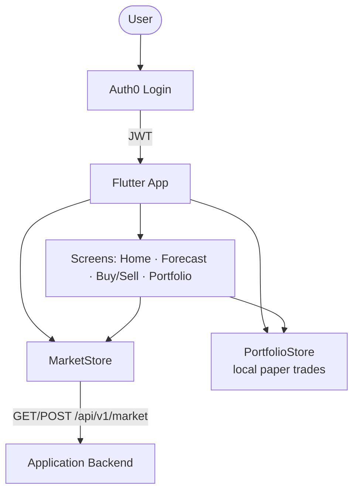
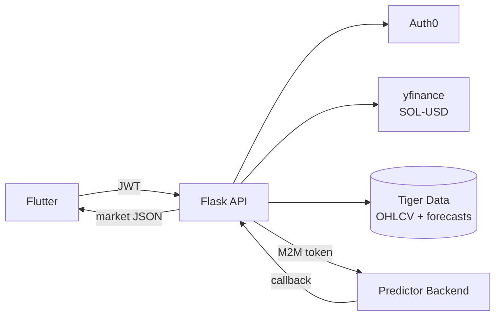
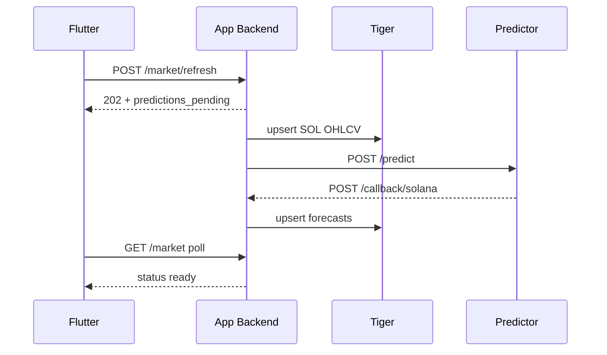
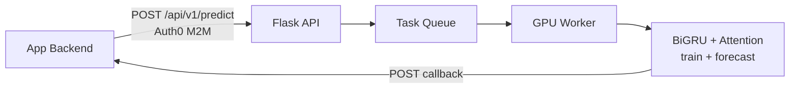

# Architecture diagrams (judge-friendly)

Three systems. Flutter never talks to the GPU. EC2 owns Auth0 users, Tiger storage, and orchestration. The desktop predictor is a private ML API on Tailscale that only accepts machine tokens and returns forecasts via callback.

---

## 1. Application frontend (Flutter)

**Story:** User signs in → app asks EC2 for market data → charts it → paper-trades on device.

---

## 2. Application backend (Flask on EC2)

**Story:** Orchestrator — refresh SOL into Tiger, call the GPU predictor, cache chart JSON for Flutter.

### Refresh loop (same service, sequential)

---

## 3. Predictor backend (Flask + GPU)

**Story:** Accept timeseries → queue → train BiGRU on GPU → POST forecasts back.

